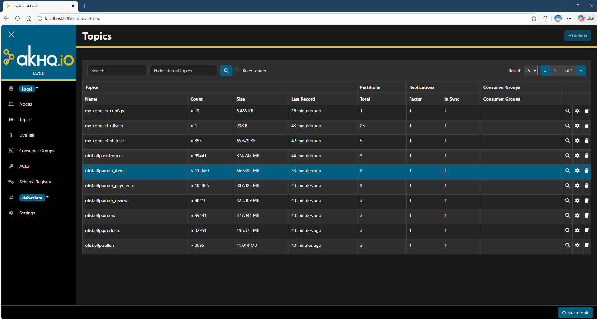
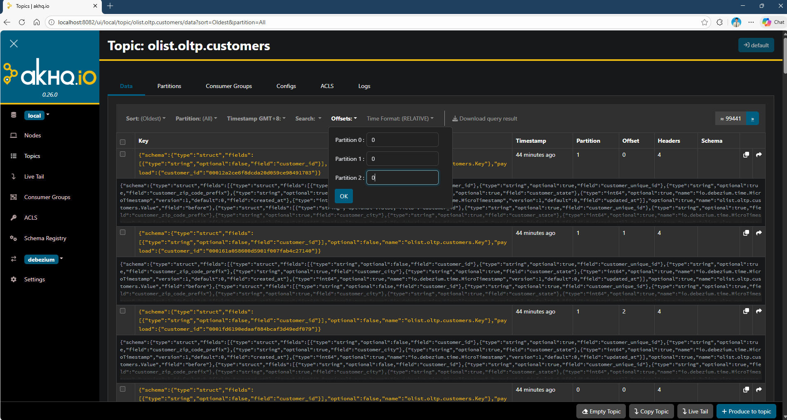
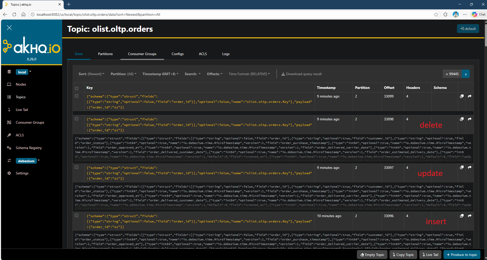
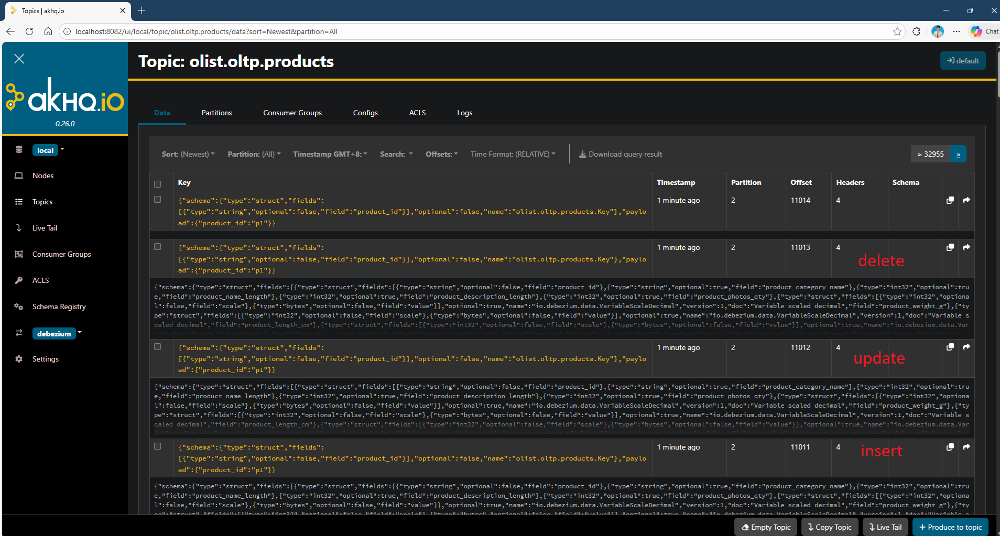

#### 1. check if debezium connect is reachable
```bash
curl http://localhost:8083/
```
##### Expected response:
```
{"version":"4.1.1","commit":"be816b82d25370ce","kafka_cluster_id":"5L6g3nShT-eMCtK--X86sw"}
```


#### 2. POST the connector
```bash
curl -X POST http://localhost:8083/connectors \
  -H "Content-Type: application/json" \
  -d @11-olist-postgres-connector.json
```
- -X: explicit HTTP method (POST / GET / PUT)
- -H: HTTP header
- -d: data 
- @: get content from file

##### Expected response:
```
{"name":"olist-postgres"}
```

#### 3 - Verify status
```
curl http://localhost:8083/connectors/olist-postgres/status
```
##### Expected response:
```
"tasks":[{"state":"RUNNING"}]
```

#### 4 - if want to update connector
```bash
curl -X PUT http://localhost:8083/connectors/olist-postgres/config \
  -H "Content-Type: application/json" \
  -d @11-olist-postgres-connector.json
```

#### 5 - view CDC events
##### Option 1 - terminal
```bash
docker exec -it kafka \
  kafka-console-consumer.sh \
  --bootstrap-server localhost:9092 \
  --topic olist.oltp.customers \
  --from-beginning
```
#### Option 2 - AKHQ


0 - earliest
e - end
. - current

#### 6 - Test CDC for all tables (refer script 13) 

#### 7. Go back to step 5 and look for the latest message
NOTE:
kafka "op":
- "c" means create or insert
- "u" means update
- "d" means delete




