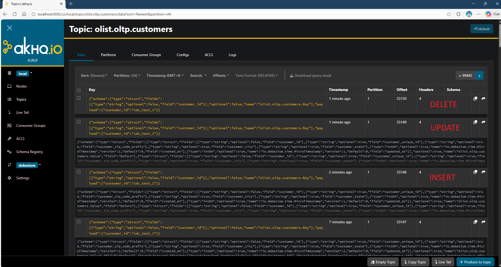
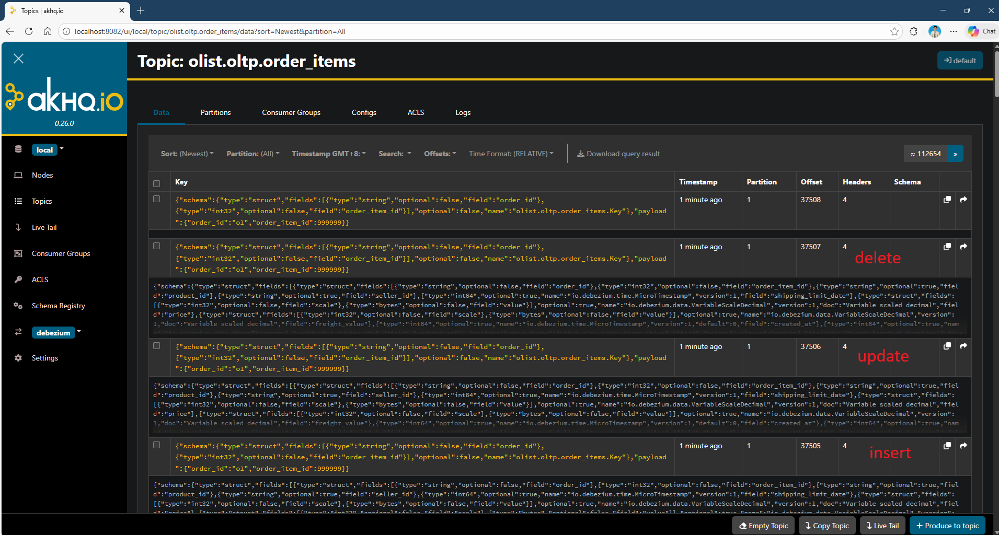
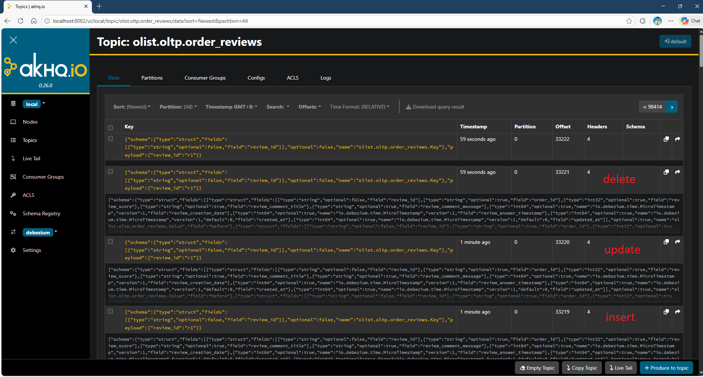

# POST connector 101

These are just some notes I wrote while first exploring CDC with & without Apicurio registry. Feel free to skip this part and just use the [script 12](../12_deploy.sh) provided if not interested.

#### 1. check if debezium connect is reachable
```bash
curl http://localhost:8083/
```
##### Expected response:
```
{"version":"4.1.1","commit":"be816b82d25370ce","kafka_cluster_id":"5L6g3nShT-eMCtK--X86sw"}
```


#### 2. POST the connector
```bash
curl -X POST http://localhost:8083/connectors \
  -H "Content-Type: application/json" \
  -d @olist-postgres-connector.json
```
- -X: explicit HTTP method (POST / GET / PUT)
- -H: HTTP header
- -d: data 
- @: get content from file

##### Expected response:
```
{"name":"olist-postgres"}
```

#### 3 - Verify status
```
curl http://localhost:8083/connectors/olist-postgres/status
```
##### Expected response:
```
"tasks":[{"state":"RUNNING"}]
```

#### 4 - if want to update connector
```bash
curl -X PUT http://localhost:8083/connectors/olist-postgres/config \
  -H "Content-Type: application/json" \
  -d @update-example.json
```

#### 5 - view CDC events
##### Option 1 - terminal
```bash
docker exec -it kafka \
  kafka-console-consumer.sh \
  --bootstrap-server localhost:9092 \
  --topic olist.oltp.customers \
  --from-beginning
```
#### Option 2 - AKHQ


0 - earliest
e - end
. - current

#### 6 - Test CDC for all tables
- refer [script 13](../scripts/13_test_cdc.sql)

#### 7. Go back to step 5 and look for the latest message
NOTE:
kafka "op":
- "c" means create or insert
- "u" means update
- "d" means delete









#### 8. update connector to include SMT
- include [SMT (single message transformation)](https://debezium.io/documentation/reference/stable/transformations/event-flattening.html) configs into the connector json 
- refer [update-example.json](../update-example.json)
```json
"transforms": "unwrap",
"transforms.unwrap.type": "io.debezium.transforms.ExtractNewRecordState",
"transforms.unwrap.drop.tombstones": "true",
"transforms.unwrap.delete.handling.mode": "rewrite"

"key.converter": "io.apicurio.registry.utils.converter.AvroConverter",
"value.converter": "io.apicurio.registry.utils.converter.AvroConverter",
"key.converter.apicurio.registry.url": "http://apicurio:8081/apis/registry/v2",
"value.converter.apicurio.registry.url": "http://apicurio:8081/apis/registry/v2",
"key.converter.apicurio.registry.auto-register": "true",
"value.converter.apicurio.registry.auto-register": "true",
"key.converter.apicurio.registry.find-latest": "true",
"value.converter.apicurio.registry.find-latest": "true"
```
- rewrite add a _deleted tag, drop tombstone remove kafka generated null
  - Without drop
  ```json
  { "__deleted": "true", "order_id": "o1" }
  null
  ```
  - With drop
  ```json
  { "__deleted": "true", "order_id": "o1" }
  ```
- use script in [step 4](#4---if-want-to-update-connector) to update the connector 
- restart connector
```bash
curl -X POST http://localhost:8083/connectors/olist-postgres/restart
```
- repeat [step 3](#3---verify-status)
- pick and redo one cdc test in [step 6](#6---test-cdc-for-all-tables)
- messages produced should be a lot shorter now


