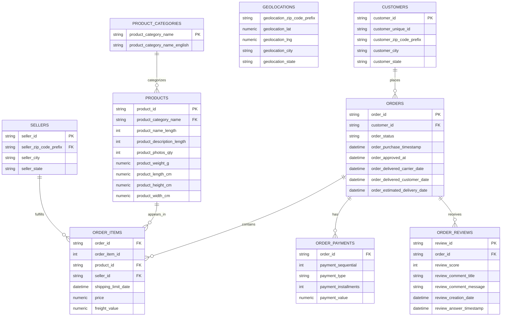

# Tables

| csv                                   | columns                                                                                                                                                                                    |
|---------------------------------------|--------------------------------------------------------------------------------------------------------------------------------------------------------------------------------------------|
| olist_customers_dataset.csv           | customer_id,customer_unique_id,customer_zip_code_prefix,customer_city,customer_state                                                                                             |
| olist_geolocation_dataset.csv         | geolocation_zip_code_prefix,geolocation_lat,geolocation_lng,geolocation_city,geolocation_state                                                                                   |
| olist_order_items_dataset.csv         | order_id,order_item_id,product_id,seller_id,shipping_limit_date,price,freight_value                                                                                          |
| olist_order_payments_dataset.csv      | order_id,payment_sequential,payment_type,payment_installments,payment_value                                                                                                      |
| olist_order_reviews_dataset.csv       | review_id,order_id,review_score,review_comment_title,review_comment_message,review_creation_date,review_answer_timestamp                                                     |
| olist_orders_dataset.csv              | order_id,customer_id,order_status,order_purchase_timestamp,order_approved_at,order_delivered_carrier_date,order_delivered_customer_date,order_estimated_delivery_date      |
| olist_products_dataset.csv            | product_id,product_category_name,product_name_lenght,product_description_lenght,product_photos_qty,product_weight_g,product_length_cm,product_height_cm,product_width_cm |
| olist_sellers_dataset.csv             | seller_id,seller_zip_code_prefix,seller_city,seller_state                                                                                                                          |
| product_category_name_translation.csv | product_category_name,product_category_name_english                                                                                                                                        |


## ERD - entity relationship diagram

- Mermaid cheat sheet to remember
```
||--o{   = 1 to many
||--||   = 1 to 1
o|--o{   = 0..1 to many
```
- Geolocations table is dirty, duplicated, or derived → no FK

