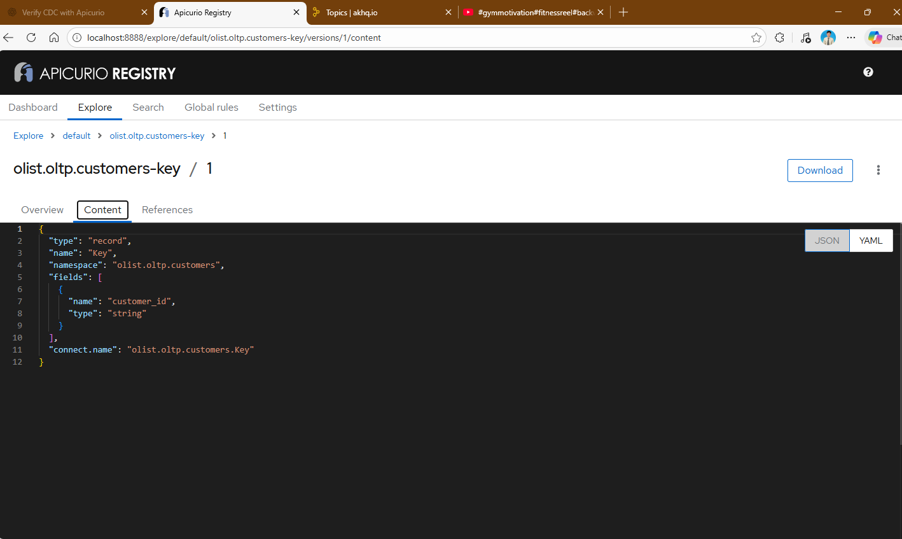
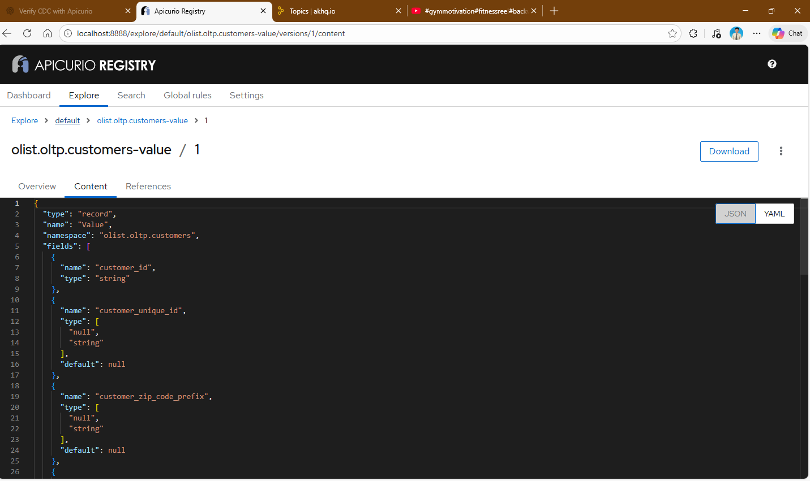
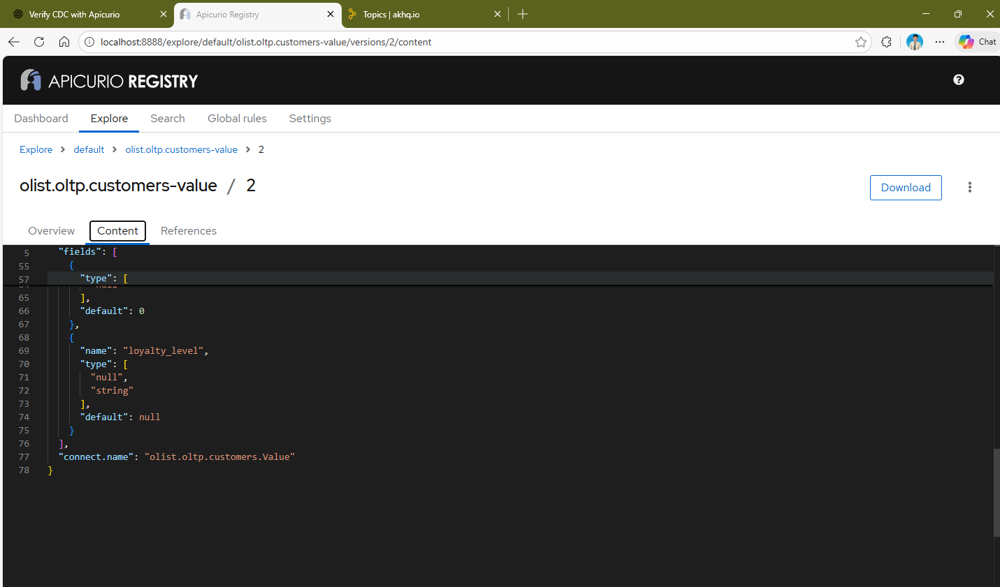

#### 1. uncomment these lines in [docker compose](../../docker/10_debezium_kafka_apicurio_akhq/docker-compose.yaml)

```yaml
- ENABLE_APICURIO_CONVERTERS=true
- KEY_CONVERTER=io.apicurio.registry.utils.converter.AvroConverter
- VALUE_CONVERTER=io.apicurio.registry.utils.converter.AvroConverter
- CONNECT_KEY_CONVERTER_APICURIO_REGISTRY_URL=http://apicurio:8081/apis/registry/v2
- CONNECT_VALUE_CONVERTER_APICURIO_REGISTRY_URL=http://apicurio:8081/apis/registry/v2
- CONNECT_KEY_CONVERTER_APICURIO_REGISTRY_AUTO_REGISTER=true
- CONNECT_KEY_CONVERTER_APICURIO_REGISTRY_FIND_LATEST=true
- CONNECT_VALUE_CONVERTER_APICURIO_REGISTRY_AUTO_REGISTER=true
- CONNECT_VALUE_CONVERTER_APICURIO_REGISTRY_FIND_LATEST=true
- CONNECT_SCHEMA_NAME_ADJUSTMENT_MODE=avro
```

Also, add these to the connector config
```json
"key.converter": "io.apicurio.registry.utils.converter.AvroConverter",
"value.converter": "io.apicurio.registry.utils.converter.AvroConverter",
"key.converter.apicurio.registry.url": "http://apicurio:8081/apis/registry/v2",
"value.converter.apicurio.registry.url": "http://apicurio:8081/apis/registry/v2",
"key.converter.apicurio.registry.auto-register": "true",
"value.converter.apicurio.registry.auto-register": "true",
"key.converter.apicurio.registry.find-latest": "true",
"value.converter.apicurio.registry.find-latest": "true"
```

#### 2. restart Connect container
```pwsh
docker compose stop connect
docker compose rm -f connect   # optional, to fully remove the old container
docker compose up -d connect
```

#### 3. Verify connector status
```pwsh
curl http://localhost:8083/connectors/olist-postgres/status
```
- Make sure both connector and tasks are RUNNING

#### 4. rerun everything in [test cdc](../../scripts/13_test_cdc.sql)
- in AKHQ, make sure all new messages in all topics become binary (non human-readable)

- in Apicurio Registry UI, check
  - topic-key: has only PK
  
  - topic-value: all columns of the table
  

#### 5. Schema Evolution test
- run one [schema change test](../../scripts/14_test_schema_evolution.sql)
- new column should appear in the registry


- even if we drop the column afterwards, registry still remembers it as v2 history