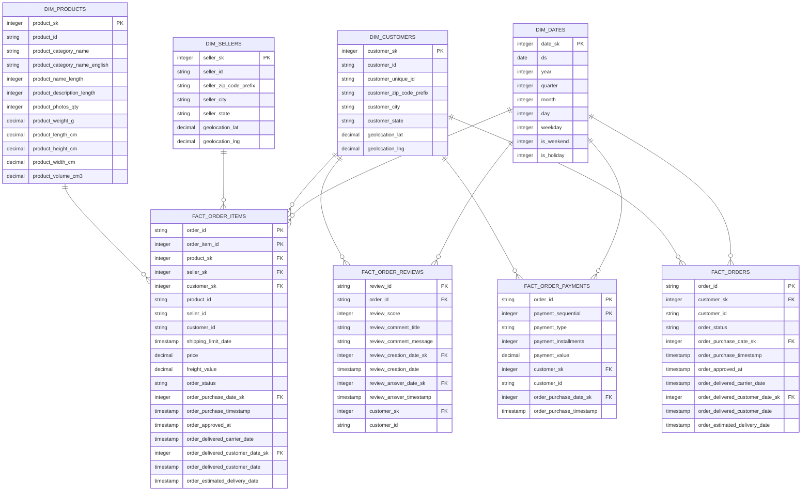

# The Gold Layer Rules
## Rule 1: Grain First (MOST IMPORTANT)
```
Define the grain BEFORE doing anything:
“One row in this table represents ______”
```
## Rule 2: Safe Join Rule
```
Only join if it does NOT change the row count of your fact table
```
## Rule 3: Metric Integrity Rule
```
Never duplicate additive metrics across rows
```
## Rule 4: One Fact = One Process
```
Each fact table represents ONE business event/process
```
## Rule 5: Controlled Flattening
```
Pre-join ONLY low-cardinality attributes that are frequently used
```
## Rule 6: Keep Join Keys
```
Always keep business keys (order_id, etc.) even after denormalization.
(Unless in very strict warehouses)
```

# Plan out the blueprint
Because I'm kinda new so I made the plan out first.
