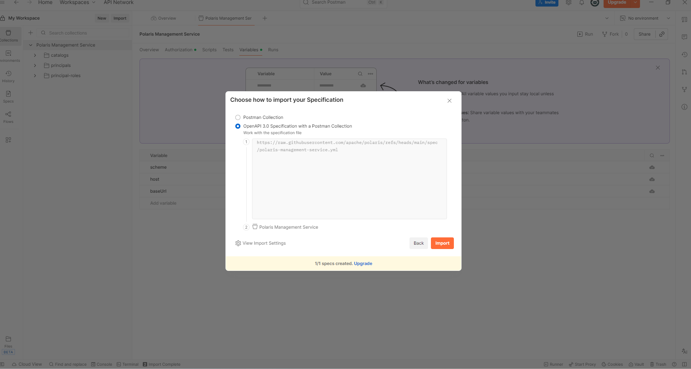
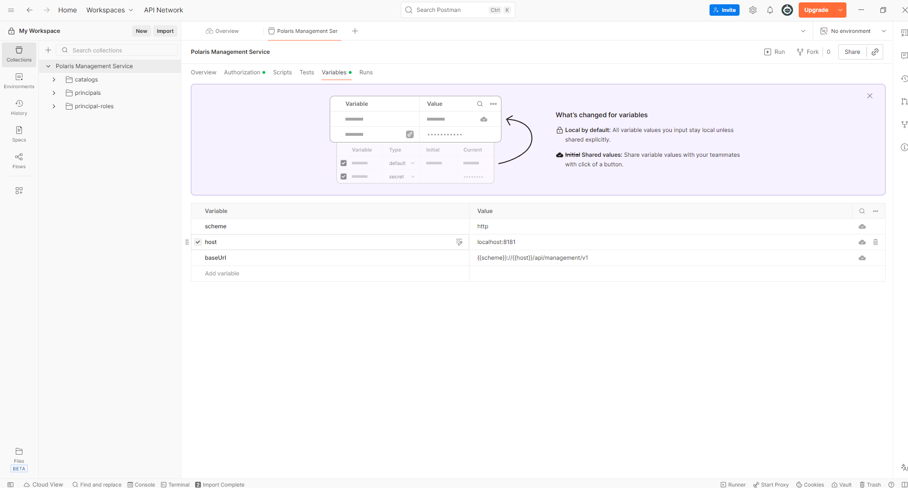
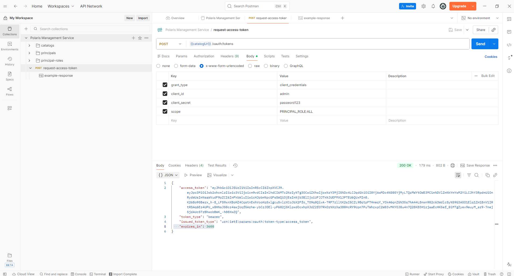
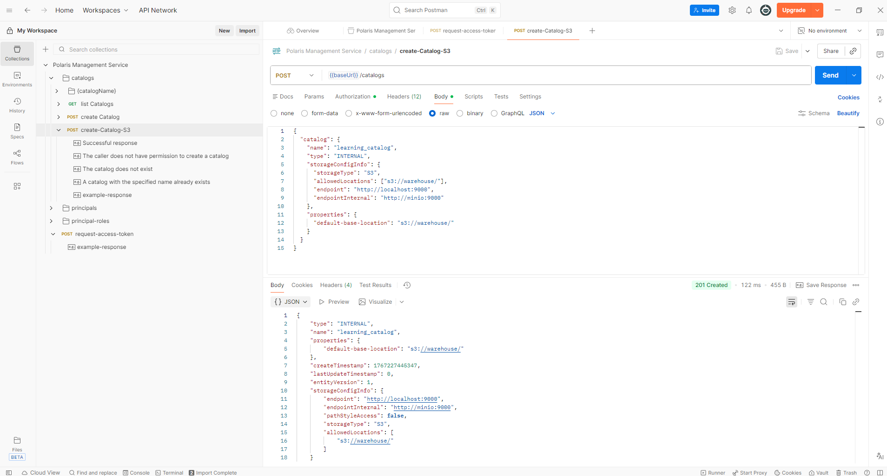
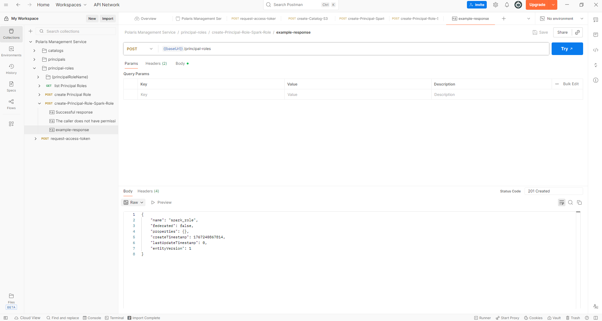
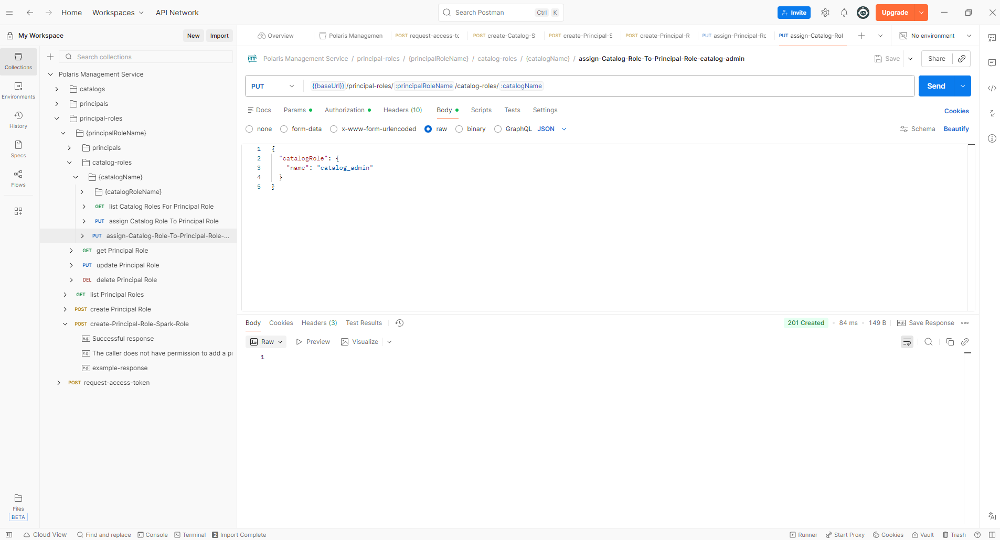

# Polaris Setup

### 1 - Install [Postman](https://www.postman.com/downloads/). Import my [saved collection](https://.postman.co/workspace/My-Workspace~f29b62ad-b11c-4c57-8947-1912bc804f26/collection/45905186-53ce3d85-f290-4e57-8015-f3250d66b879?action=share&creator=45905186) or you do it yourself from the steps below.

### 2 - Get Polaris API link
- Go to [polaris docs](https://polaris.apache.org/)
- Click on [Management API](https://polaris.apache.org/in-dev/unreleased/polaris-api-specs/polaris-management-api/)

- Get the link shown

- Open Postman ➡️ Import ➡️ Paste the link you copied

- ```Polaris Management Service``` ➡️ ```Variables```
  - ```scheme: http```
  - ```host: localhost:8181```


### 3 - [Connect Using REST APIs (token)](https://polaris.apache.org/releases/1.1.0/getting-started/using-polaris/#connecting-using-rest-apis)
- **Warning**: Deprecated. This step 3 should be replaced with [Keycloak](https://hub.docker.com/r/keycloak/keycloak) in the future.
- Also since free version of postman does not allow us to use another spec (like what we did in step 2) we are doing this step manually like below:
  - ```Polaris Management Service``` ➡️ ```Variables```
    - ```catalogUrl: {{scheme}}://{{host}}/api/catalog/v1```
  - Click on the ➕ icon beside ```Polaris Management Service``` to add request
    - rename this collection as request-access-token
    - use **POST** method, ```{{catalogUrl}}/oauth/tokens```
    - **Headers** tab: Add ```Polaris-Realm : POLARIS```.
    - **Body** tab: Select *x-www-form-urlencoded* and enter:
        - ```grant_type: client_credentials```
        - ```client_id: admin```
        - ```client_secret: password123```
        - ```scope: PRINCIPAL_ROLE:ALL```
    - Hit **Send**. The token is temporary and expires in 1 hour. Hit **Save** so we can reuse this request-access-token collection again.
    - Hit **Save Response** and rename as example-response
  

### 4 - [Role-based Access Control RBAC](https://polaris.apache.org/releases/1.2.0/managing-security/access-control/)
#### Create Catalog
- ```Polaris Management Service``` ➡️ ```catalogs``` ➡️ ```POST create Catalog``` (to link polaris to Minio)
  - **Request Type**: ```POST```
  - **URL**: ```{{baseUrl}}/catalogs```
  - **Authorization** tab ➡️ ```Auth Type``` ➡️ ```Bearer Token```.
    - Paste the token we created at Step 3.
  - **Headers** tab:
    - ```Polaris-Realm```: ```POLARIS```
  - **Body (Raw JSON)**:
    ```json
    {
        "catalog": {
            "name": "learning_catalog",
            "type": "INTERNAL",
            "properties": {
            "default-base-location": "s3://olist-ecommerce/"
            },
            "storageConfigInfo": {
            "storageType": "S3",
            "allowedLocations": ["s3://olist-ecommerce/"],
            "endpoint": "http://localhost:9000",
            "endpointInternal": "http://minio:9000",
            "pathStyleAccess": true
            }
        }
    }
    ```
  - **Expected Result**: ```201 Created```
  - Hit **Save AS** and rename as create-Catalog-S3
  - Hit **Save Response** and rename as example-response


#### Create Principal
- ```Polaris Management Service``` ➡️ ```principals``` ➡️ ```POST create Principal``` (Spark user)
  - **Request Type**: POST
  - **URL**: ```{{baseUrl}}/principals```
  - **Authorization** tab ➡️ ```Auth Type``` ➡️ ```Bearer Token```.
    - Paste the token we created at Step 3.
  - **Headers**:
    - ```Polaris-Realm: POLARIS```
  - **Body (Raw JSON)**:
    ```json
    {
        "principal": {
            "name": "spark_user"
        }
    }
    ```
  - **Expected Result**: ```201 Created```
  - Hit **Save as** and rename as create-Principal-Spark
  - Hit **Save Response** and rename as example-response (**IMPORTANT**: we need ```clientId``` and ```clientSecret``` to be put into [spark-defaults.conf](../docker/17_minio_spark_iceberg_polaris/spark/conf/spark-defaults.conf))


#### Principal Role
- bridge between principal and catalog
- Chain: principal ➡️ Principal Role ➡️ catalog
- Example: spark_user ➡️ spark_role ➡️ learning_catalog
- their API url has this kind of pattern:
  - principals/spark_user
  - principal-roles/spark_role
  - catalog-roles/learning_catalog/catalog_admin

##### Create Principal Role
- ```Polaris Management Service``` ➡️ ```principal-roles``` ➡️ ```POST create Principal Role```
- **Request Type**: POST
- **URL**: ```{{baseUrl}}/principal-roles```
- **Authorization** tab ➡️ ```Auth Type``` ➡️ ```Bearer Token```.
  - Paste the token we created at Step 3.
- **Body (Raw JSON)**:
  ```json
  { "principalRole": { "name": "spark_role" } }
  ```
- **Expected Result**: ```201 Created```
- Hit **Save as** and rename as create-Principal-Role-Spark-Role
- Hit **Save Response** and rename as example-response


##### Link User to Role
- ```Polaris Management Service``` ➡️ ```principals``` ➡️ ```{principalName}``` ➡️ ```principal-roles``` ➡️ ```PUT assign Principal Role```
- **Request Type**: PUT
- **URL**: {{baseUrl}}/principals/:principalName/principal-roles
- **Params** tab ➡️ Path Variables
  - ```principalName: spark_user```
- **Authorization** tab ➡️ ```Auth Type``` ➡️ ```Bearer Token```.
  - Paste the token we created at Step 3.
- **Body (Raw JSON)**:
  ```json
  { "principalRole": { "name": "spark_role" } }
  ```
- **Expected Result**: ```201 Created``` (no response)
- Hit **Save as** and rename as assign-Principal-Role-Spark-Role


##### Grant Access to Principal Role
- ```Polaris Management Service``` ➡️ ```principal-roles``` ➡️ ```{principalRoleName}``` ➡️ ```catalog-roles``` ➡️ ```{catalogName}``` ➡️ ```PUT assign Catalog Role To Principal Role```
- **Request Type**: PUT
- **URL**: {{baseUrl}}/principal-roles/:principalRoleName/catalog-roles/:catalogName
- **Params** tab ➡️ Path Variables
  - ```principalRoleName: spark_role```
  - ```catalogName: learning_catalog```
- **Authorization** tab ➡️ ```Auth Type``` ➡️ ```Bearer Token```.
  - Paste the token we created at Step 3.
- **Body (Raw JSON)**:
  ```json
  { "catalogRole": { "name": "catalog_admin" } }
  ```
- **Expected Result**: ```201 Created``` (no response)
- Hit **Save as** and rename as assign-Catalog-Role-To-Principal-Role-catalog-admin


### 5 - Final Polaris Setup Check
- ```Polaris Management Service``` ➡️ ```principal-roles``` ➡️ ```{principalRoleName}``` ➡️ ```catalog-roles``` ➡️ ```{catalogName}``` ➡️ ```Get list Catalog Role For Principal Role```
- **Params** tab ➡️ Path Variables
  - ```principalRoleName: spark_role```
  - ```catalogName: learning_catalog```
- **Authorization** tab ➡️ ```Auth Type``` ➡️ ```Bearer Token```.
  - Paste the token we created at Step 3.
- **Expected Result**: ```200 OK```
  ```json
  {
        "roles": [
            {
                "name": "catalog_admin",
                "properties": {},
                "createTimestamp": 1767227445348,
                "lastUpdateTimestamp": 1767227445348,
                "entityVersion": 1
            }
        ]
    }
  ```