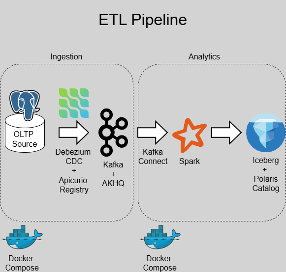

# data_pipelines_batch_stream_vector
This repository captures my hands-on journey in building three core types of data pipelines, serving as a single source of truth for modern Data Engineering practices. All components are **fully runnable locally**, enabling fast iteration, easy debugging, and minimal reliance on cloud infrastructure.

While processing over 10 TB of data per day remains costly and uncommon, such large-scale pipelines are increasingly relevant as LLMs drive demand for massive datasets.

> **Note**: This project is fully open source and developed entirely with **free tools**—no Claude, no Cursor—only ChatGPT Free and other open-source software.

# Pipeline Types
- [batch pipeline](#batch-pipeline-lakehouse---micro-batch)
- realtime streaming pipeline (require flink to get ms latency)
- vector db pipeline

## Batch Pipeline (Lakehouse - Micro batch)


OLTP (postgresql) → Debezium → Kafka + Apicurio + AKHQ → Minio → (attempting iceberg kafka sink connector)

### Dataset: 
[Brazilian E-Commerce Public Dataset by Olist](https://www.kaggle.com/datasets/olistbr/brazilian-ecommerce?resource=download)

### Tools used

#### Local PC
- [PostgreSQL 18](https://www.postgresql.org/download/) - Source: OLTP DB
- [Docker Compose](https://www.docker.com/) - To run multiple containers

#### Ingestion Stack
- [Debezium 3.4](https://quay.io/repository/debezium/connect) - To enable Change Data Capture CDC
  - [docs](https://debezium.io/)
- [Apache Kafka 4.1.1 - Kraft](https://hub.docker.com/r/apache/kafka) - To handle message queues
  - [docs](https://kafka.apache.org/)
- [Apicurio Registry 3.1.6 & its UI](https://quay.io/repository/apicurio/apicurio-registry) - Schema registry to serialize/deserialize message queues
  - [docs](https://www.apicur.io/registry/docs/apicurio-registry/3.1.x/index.html)
- [AKHQ 0.26.0](https://hub.docker.com/r/tchiotludo/akhq) - - Apache Kafka GUI
  - [docs](https://akhq.io/docs/)
- [Alpine Curl](https://hub.docker.com/r/alpine/curl) - to deploy debezium connector automatically

#### Engineering Stack
- [Minio - RELEASE.2025-09-07T16-13-09Z-cpuv1](https://github.com/minio/minio) - S3 compatible storage
  - [docs](https://docs.min.io/enterprise/aistor-object-store/reference/aistor-server/settings/root-credentials/)
- [Minio Client (mc)](https://hub.docker.com/r/minio/mc)
- [Apache Spark](https://hub.docker.com/r/apache/spark)
  - [docs](https://spark.apache.org/)
- [Apache Iceberg](https://iceberg.apache.org/releases/) - Open table format  (metadata inside table)
- [Apache Polaris](https://polaris.apache.org/) - REST catalog for Apache Iceberg (AWS Glue catalog substitute - metadata outside table)
- [Postman](https://www.postman.com/) - API platform to work with APIs
- [Apache Maven](https://maven.apache.org/) - jar build tool

#### ELK Stack - Logging and Monitoring tool

### Quickstart (Local PostgreSQL + Makefile)

Assumption: PostgreSQL is already installed and running on your local machine.

1. Clone this repo. Put the Olist CSV files under `data/raw/olist` (default), or pass a custom `DATASET_DIR`.
2. Export your PostgreSQL password so `psql` can connect non-interactively:
    ```bash
    export PGPASSWORD='your_postgres_password'
    ```
3. cd into the path where [Makefile](./Makefile) is located. Run the postgres bootstrap:
    ```bash
    make setup-postgres DB_USER=postgres DB_NAME=olist DB_HOST=localhost DB_PORT=5432
    ```
4. cd into the path where cdc stack [docker-compose.yaml](infra/docker/cdc_stack/docker-compose.yaml) is located, then run the docker container. Refer [this link](https://github.com/SoongGuanLeong/docker-beginner-tutorial-followalong) for commonly used docker commands.
    ```bash
    cd infra/docker/cdc_stack
    docker network create data-pipeline-net
    docker compose up -d
    ```

5. Test if CDC is working. Check at AKHQ UI if there is new messages that come in after we run the test:
    ```bash
    cd ../../..
    make test-cdc
    ```
6. cd into the path where lakehouse stack [docker-compose.yaml](infra/docker/lakehouse_stack/docker-compose.yaml) is located, then run the docker container.
    ```bash
    cd infra/docker/lakehouse_stack
    docker compose up -d --build
    ```

7. Run [16_polaris_bootstrap.sh](infra/bootstrap/16_polaris_bootstrap.sh) using the make command below. It will setup the minimal access needed by Polaris and automatically fill the ID and SECRET into [spark-defaults.conf](infra\docker\lakehouse_stack\spark\conf\spark-defaults.conf). 
   ```bash
   cd ../../..
   make init-polaris
   ```
8. Restart spark and get the log. Get the token from the terminal output and use it to log into spark at [localhost.](http://localhost:8084/)
   ```bash
   cd infra/docker/lakehouse_stack
   docker compose restart spark
   docker compose logs spark
   ```